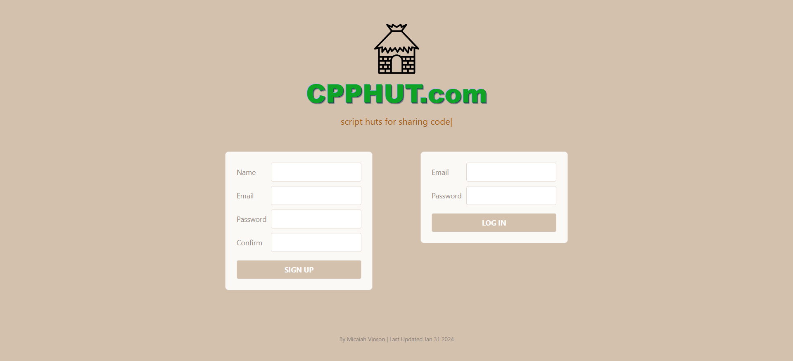

# CPPHUT



By Micaiah Vinson - PERSCHOLAS 2023 MOD 3 FINAL 

## Introduction

CPPHUT.com is a script-sharing website where you can compile your own scripts, create/save/edit/delete scripts in your script hut, search for other huts, and clone other people's scripts. It is an extensive demonstration of back-end development with full-stack understanding, showcasing database management with many efficient Mongoose operations.

##Documentation Images


## Technologies Used
- ACE EDITOR: editor for code
- Judge0: Compiling API for code
- JSEncrypt: encryption for script cookie security
- React-cookie: Simple Cookie Management for Script Functions 
- BCrypt: hashing for user security
- Bootstrap: for (future) front-end CSS
- MongoDB: serverside database management

## Getting Started
- Trello: https://trello.com/invite/b/Zcu7nvRN/ATTI0915efd1d99f0bcd8276c0cd02cb8d11CBFAF5BD/perscholasfinal (Please do not move the cards!)
- Deployment: https://cpphut.onrender.com/

## Unsolved Problems
- 404 links don't show always the problem passed to them.
- Some users have scripts in their hut that no longer exist

## Future Enhancements
- Using Bootstrap to enhance the front-end of the application
- Stretch Goal Feature: Download + Upload Scripts to and from your machine
- Stretch Goal Feature: Access account settings to change name, change email, change password, and completely delete account and all associated scripts

## Installation

```bash
npm i
```
